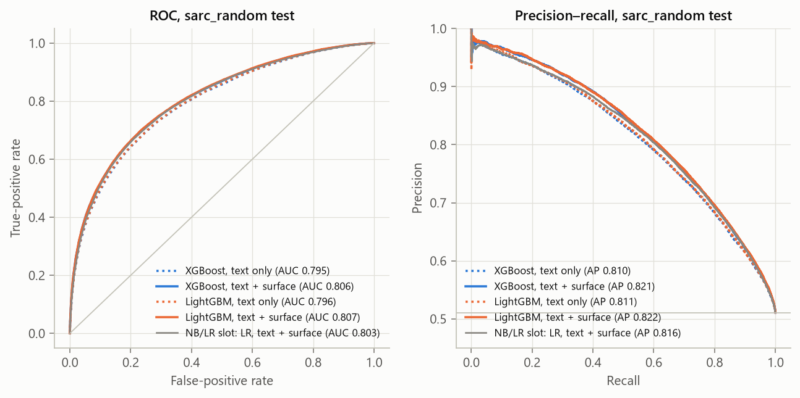
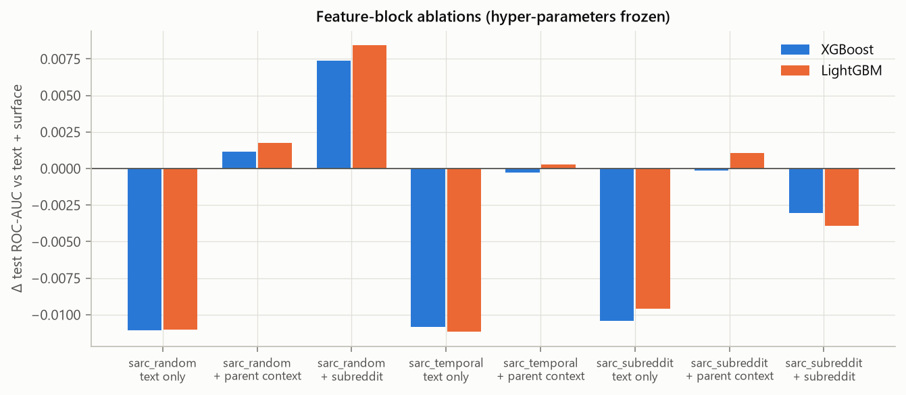
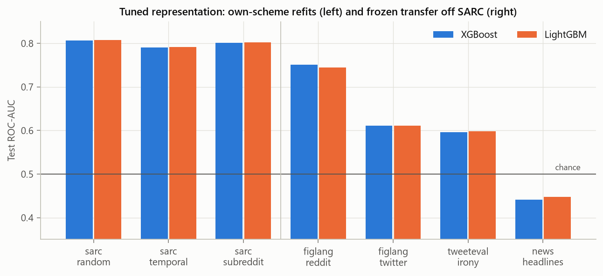
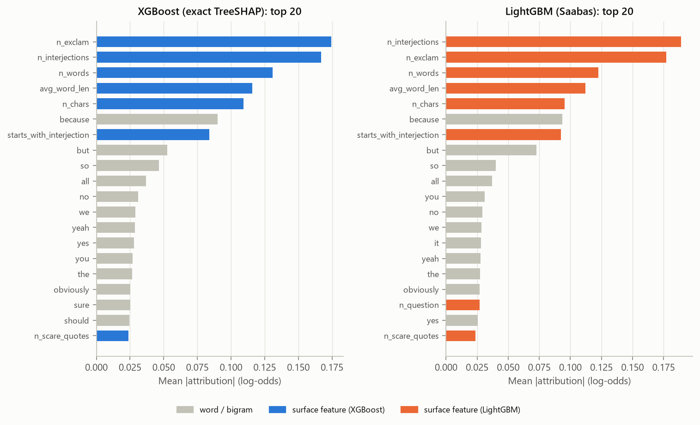
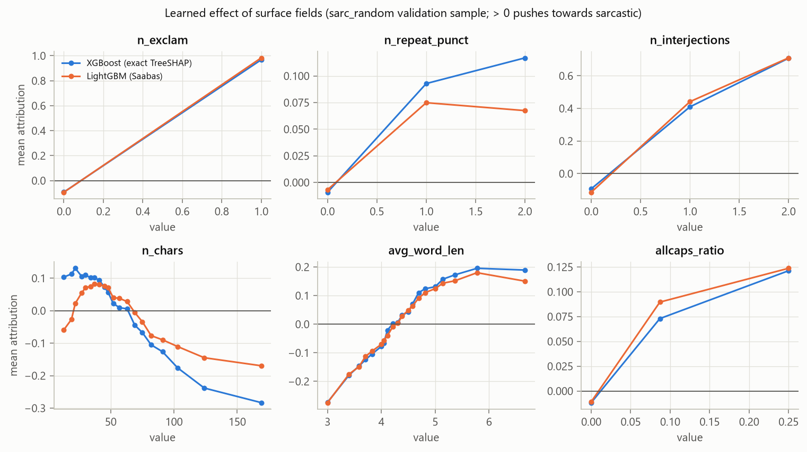

# Gradient-boosting baselines — LightGBM and XGBoost

Person 4 · CS3244 Group 1
Notebook: [`modelling/gradient_boosting/gbdt_baselines.ipynb`](../modelling/gradient_boosting/gbdt_baselines.ipynb).
Every number below is read from `results/gbdt/`; the figures are in `figures/gbdt/`.

---

## Summary

**LightGBM on reply TF-IDF plus the 17 surface counts is the strongest model
the project has on `sarc_random` so far: test ROC-AUC 0.8074, accuracy 0.7322,
F1 0.7281.** XGBoost on the same features is 0.0013 AUC behind (0.8061 / 0.7308
/ 0.7244) — a gap at noise level; the two libraries agree on almost everything
in this report. Both slots used byte-identical partitions (row-ID hashes match
the NB/LR run for all 21 of them), so the comparison is direct.

**Trees beat the linear model, but not by much.** On identical features
gradient boosting adds 0.002 AUC over logistic regression on text alone and
0.0045 with the surface block (LR: 0.7941 and 0.8029). Most of the signal is
lexical and close to additive. Where trees do earn their keep is the surface
block: it is worth +0.011 AUC to them against +0.009 to LR, because several of
those cues act non-linearly (§6).

**Parent context adds almost nothing; subreddit adds only what it memorises.**
The parent block (5 length/overlap fields plus a 5,000-term parent TF-IDF) is
worth +0.0012 to +0.0017 AUC on `sarc_random` and nothing on the two stress
splits. A subreddit encoding is worth +0.0074 to +0.0084 on `sarc_random`, where
every test community was seen in training, and *costs* 0.003 to 0.004 on
`sarc_subreddit`, where none was — LightGBM's F1 there falls from 0.717 to 0.638.
It measures each community's `/s` habits, not sarcasm.

**Generalisation is slightly better than LR's, transfer is not.** Refitting on
the time split costs 0.016 AUC and on the community split 0.005 (LR: 0.017 and
0.007). Off Reddit, the boosted models do no better than LR and somewhat worse
on the FigLang sets; on news headlines every model is below chance (0.44).

**Both libraries rely on the same handful of cues.** Their top seven features
are identical: interjection count, exclamation mark, word count, average word
length, character count, the word *because*, and starting with an interjection.
The mock-agreement vocabulary the EDA found (*obviously, totally, clearly, sure,
yeah*), together with *yes* and *nah*, pushes towards sarcastic; *lol, pretty,
think, still* push towards sincere.

---

## 1. Setup

### Data and protocol

The shared cleaned splits, read through `pipeline/load.py`; the notebook refuses
to run if any partition's row count differs from the split card, and checks
that its ordered row-ID hashes equal the NB/LR slot's (`data_audit.csv`). The
protocol is the NB/LR slot's:

- Hyper-parameters, early stopping and thresholds are chosen on `sarc_random`
  validation only; test partitions are scored once, after every choice is fixed.
- Two thresholds are reported: 0.50, and the validation threshold that
  maximises recall at precision ≥ 0.75 (the team's operating point).
- **Stress splits**: features and booster are refitted on each scheme's own
  training partition with the hyper-parameters, tree count and threshold frozen
  from `sarc_random`.
- **Transfer**: the `sarc_random` models score the four non-SARC test sets
  with no target-side fitting or calibration.

### Features

| Block | Columns | Notes |
|---|---:|---|
| Reply TF-IDF | 20,000 | 1–2-grams, `min_df=3`, sublinear tf; fed to the trees as a sparse matrix, no SVD |
| Surface | 17 | Reply-only counts, the same list as NB/LR; left raw (trees need no scaling or binning) |
| Parent context *(ablation)* | 5 + 5,000 | `parent_n_words`, `parent_n_chars`, `parent_is_empty`, `parent_jaccard`, `len_ratio_to_parent`, and a parent-text TF-IDF |
| Subreddit *(ablation)* | 2 | Smoothed sarcasm rate (out-of-fold on train, GroupKFold on `parent_key`) and log frequency |

All vocabularies and encodings are fitted on the training partition only.

### Feature budget

A pilot with fixed hyper-parameters on the full `sarc_random` train set the
budget (details in the [README](../modelling/gradient_boosting/README.md)).
Doubling the vocabulary from 10,000 to 20,000 terms raised validation AUC by
0.003 (XGBoost) and 0.004 (LightGBM). XGBoost gained nothing from more histogram
bins (0.7990 / 0.7986 / 0.7982 at 32 / 64 / 128) while its GPU memory rose from
4.5 to 7.8 GB, and past the 8 GB card a fit slows twenty-fold; a 50,000-term
run crashed the laptop. XGBoost therefore uses 32 bins and depth ≤ 8, with its
histogram cache capped (memory only — the trees are bit-identical) and a
callback that aborts any fit above 7.2 GB.

### Hyper-parameter search

25 Optuna (TPE, seed 3244) trials per library on the full training partition,
learning rate 0.1, early stopping on validation AUC (patience 100), up to 8,000
trees.

| | Validation ROC-AUC | Trees | Chosen hyper-parameters |
|---|---:|---:|---|
| XGBoost (GPU) | 0.8036 | 7,901 | depth 7, min child weight 3.4, subsample 0.82, column sample 0.74, L1 2.66, L2 0.013 |
| LightGBM (CPU) | 0.8044 | 1,041 | 133 leaves, min 14 rows per leaf, feature fraction 0.87, bagging 0.88, L1 0.42, L2 6.87 |

The searches took 96 and 98 minutes, run in parallel on the GPU and the CPU.

---

## 2. In-domain results

`sarc_random` test, threshold 0.50 (n = 137,065):

| Model | Features | ROC-AUC | PR-AUC | Accuracy | Precision | Recall | F1 | Brier |
|---|---|---:|---:|---:|---:|---:|---:|---:|
| **LightGBM** | **text + surface** | **0.8074** | **0.8224** | **0.7322** | 0.7559 | 0.7023 | **0.7281** | **0.1784** |
| XGBoost | text + surface | 0.8061 | 0.8215 | 0.7308 | 0.7590 | 0.6929 | 0.7244 | 0.1790 |
| LightGBM | text only | 0.7964 | 0.8113 | 0.7217 | 0.7445 | 0.6929 | 0.7178 | 0.1835 |
| XGBoost | text only | 0.7950 | 0.8096 | 0.7212 | 0.7510 | 0.6793 | 0.7133 | 0.1841 |



### Against the other slots (same test partition, 0.50)

| Slot | Model | ROC-AUC | Accuracy | F1 |
|---|---|---:|---:|---:|
| Gradient boosting | LightGBM, text + surface | **0.8074** | **0.7322** | **0.7281** |
| Gradient boosting | XGBoost, text + surface | 0.8061 | 0.7308 | 0.7244 |
| Probabilistic / linear | LR, text + surface | 0.8029 | 0.7283 | 0.7261 |
| Margin-based | Linear SVM, text + lexicon + surface ¹ | 0.8026 | 0.7290 | 0.7247 |
| Gradient boosting | LightGBM, text only | 0.7964 | 0.7217 | 0.7178 |
| Probabilistic / linear | LR, text only | 0.7941 | 0.7206 | 0.7187 |
| Probabilistic / linear | MNB / CNB, text only | 0.7798 | 0.704 | 0.708 / 0.704 |
| Glass-box | EBM | 0.7620 | 0.6915 | 0.6799 |

¹ From the outputs of `modelling/Margin-Based/margin-based_baseline.ipynb`
(its result files are not in the repository). Its feature set differs: 1–2-gram
TF-IDF with up to 500,000 terms, lexicon features of the reply and its parent,
and all 22 safe numeric fields including the five parent fields.

The ranking is stable but the margins are small: four to five thousandths of
AUC separate the best boosted model from the best linear ones. The boosted models are
also slightly better calibrated (Brier 0.178–0.179 against LR's 0.181).

### Precision-oriented operating point

Threshold chosen on `sarc_random` validation for precision ≥ 0.75, then frozen:

| Model | Features | Threshold | Precision | Recall | F1 |
|---|---|---:|---:|---:|---:|
| LightGBM | text + surface | 0.4987 | 0.7549 | 0.7035 | 0.7283 |
| XGBoost | text + surface | 0.4927 | 0.7547 | 0.7011 | 0.7269 |

The 0.75 precision requested on validation holds on test. Both thresholds sit
almost exactly at 0.5, another sign that the probabilities are close to
calibrated; at the same precision LR reaches recall 0.694.

---

## 3. Feature-block ablations

Test ROC-AUC change against text + surface, hyper-parameters frozen:

| Split | Change | XGBoost | LightGBM |
|---|---|---:|---:|
| `sarc_random` | remove surface (text only) | −0.0110 | −0.0110 |
| | add parent context | +0.0012 | +0.0017 |
| | add subreddit | +0.0074 | +0.0084 |
| `sarc_temporal` | remove surface | −0.0108 | −0.0112 |
| | add parent context | −0.0003 | +0.0003 |
| `sarc_subreddit` | remove surface | −0.0104 | −0.0096 |
| | add parent context | −0.0001 | +0.0011 |
| | add subreddit | **−0.0030** | **−0.0039** |



**Surface cues** are the one block that pays consistently: about 0.010–0.011 AUC
on every split.

**Parent context** does not. Represented as the parent's words plus its length
and word overlap with the reply, it adds at most 0.0017 and nothing on the
stress splits. This is what the EDA predicted: every cheap summary of the parent
(length, overlap, length ratio) was flat across the classes, so if context helps
it must be through semantic incongruity between reply and parent — something a
bag of the parent's words cannot express. The glass-box slot's
sentiment-incongruity features are the more promising direction.

**Subreddit** is the cautionary result. On `sarc_random` it is the largest gain
of any block, because training and test share communities and the model can
memorise each one's sarcasm rate (8% in r/RoastMe, 79% in r/creepyPMs). On
`sarc_subreddit` every test community is unseen, the encoding falls back to the
training prior, and the model that learned to lean on it is now worse than the
one that never had it. The threshold-dependent numbers show the damage most
clearly: LightGBM's F1 at 0.50 drops from 0.717 to 0.638. Any claim that
subreddit helps must be made on this split, and here it does not.

---

## 4. Generalisation across time and communities

Each scheme refitted on its own training partition, everything else frozen:

| Split | XGBoost AUC | Δ | LightGBM AUC | Δ | LR AUC (NB/LR slot) | Δ |
|---|---:|---:|---:|---:|---:|---:|
| `sarc_random` | 0.8061 | — | 0.8074 | — | 0.8029 | — |
| `sarc_temporal` | 0.7906 | −0.0155 | 0.7918 | −0.0157 | 0.7856 | −0.0173 |
| `sarc_subreddit` | 0.8014 | −0.0046 | 0.8023 | −0.0051 | 0.7963 | −0.0066 |

Text + surface throughout. Time is the harder shift for every model, about
three times the cost of unseen communities; the boosted models lose slightly
less than LR on both. Part of the temporal drop is the label shift built into
the split (53.8% sarcastic in train, 45.8% in test), which hurts the
threshold-based numbers more than AUC.



---

## 5. Transfer off SARC

The `sarc_random` models, unchanged, on each corpus's test set (ROC-AUC):

| Target | XGBoost text | XGBoost text + surface | LightGBM text | LightGBM text + surface | LR text | LR text + surface |
|---|---:|---:|---:|---:|---:|---:|
| `figlang_reddit` | 0.7358 | 0.7510 | 0.7341 | 0.7450 | 0.7562 | 0.7593 |
| `figlang_twitter` | 0.6327 | 0.6111 | 0.6329 | 0.6106 | 0.6683 | 0.6466 |
| `tweeteval_irony` | 0.6180 | 0.5964 | 0.6269 | 0.5986 | 0.6153 | 0.5847 |
| `news_headlines` | 0.4337 | 0.4416 | 0.4370 | 0.4475 | 0.4168 | 0.4210 |

Transfer fails the same way for every slot. Same-platform Reddit data holds up
(0.73–0.76), Twitter falls to 0.60–0.67, and news headlines are anti-correlated
with the labels. Two observations specific to the trees:

- **They do not transfer better than LR, despite being better in-domain.** On
  the FigLang sets they are 0.01–0.04 AUC behind. Trees fit sharper,
  Reddit-specific interactions, and that extra in-domain accuracy does not
  survive a change of platform.
- **The surface block hurts on Twitter** for every model (−0.02 to −0.03).
  Reddit's exclamation and interjection habits are not Twitter's, so the cues
  that help most in-domain mislead most off-domain.

---

## 6. What the models use

### Method

Attributions are computed for text + surface on a fixed 10,000-row validation
sample, in log-odds, and checked to sum to each model's raw score.

- **XGBoost**: exact TreeSHAP.
- **LightGBM**: Saabas path attribution. Exact TreeSHAP is numerically unusable
  for these models: leaf-wise growth on sparse word features produces
  comb-shaped trees with a median depth of 90 levels (maximum 130), and
  TreeSHAP's path weights overflow on paths that long — LightGBM's own
  `pred_contrib` (and the `shap` package, which calls it) returns values around
  1e16. Saabas attribution credits each split's change in node value to its
  feature and is stable at any depth.
- **Agreement check**: on the same XGBoost model, Saabas and exact TreeSHAP
  rank features with Spearman ρ = 0.983 over the top 200 and share 17 of the top
  20 (`attribution_check.json`). The LightGBM numbers can be read like SHAP
  values for ranking and direction, though not as exact Shapley values.

### Feature ranking



The two models agree on their top seven features, in nearly the same order:
interjection count, exclamation mark, word count, average word length,
character count, *because*, and starting with an interjection. The 17 surface
fields carry 18–20% of all attribution mass and the 20,000 word/bigram columns
the remaining 80–82%; individually, though, the leading surface fields outweigh
every single word except *because*. The weakest ones (elongation, all-caps word
count) rank between 70th and 130th overall, behind dozens of words.

### Learned shapes



- **Exclamation mark: a single step.** In the cleaned corpus `n_exclam` is
  effectively binary — 99.96% of training replies have zero or one, because the
  cleaner collapses runs like `!!!` and records them in `n_repeat_punct`. One
  exclamation mark moves the log-odds from −0.09 to about +0.97 in both models.
  Only about 50 of the 639,638 training replies have four or more, so the
  glass-box report's "falls back past four marks" describes a handful of
  comments. Repetition itself is a weak cue: +0.07 to +0.12, flat from two runs
  on.
- **Interjections rise steadily**: −0.1, +0.4, +0.7 for zero, one and two.
- **Length is an inverted U.** Replies of roughly 25–60 characters lean
  sarcastic (XGBoost extends this to the very shortest ones, LightGBM pushes
  those slightly the other way); beyond about 70 characters the push turns
  negative and keeps falling (−0.17 to −0.28 at 170 characters). This matches
  the EBM's finding that length matters strongly once the other features are
  held fixed, even though both classes have the same median length.
- **Average word length rises monotonically**, from −0.27 at three letters to
  about +0.19 at six: the mock-formal register that *obviously, clearly,
  totally* also signal.

### Words

Mean attribution over the validation replies that contain the word:

| Word | XGBoost | LightGBM | Group |
|---|---:|---:|---|
| *obviously* | +1.15 | +1.35 | EDA marker |
| *clearly* | +1.10 | +1.26 | EDA marker |
| *totally* | +1.07 | +1.12 | EDA marker |
| *because* | +0.90 | +0.94 | EDA marker (rank 1 word in both) |
| *sure* | +0.53 | +0.43 | EDA marker |
| *wow* | +0.45 | +0.45 | EDA marker |
| *yeah* | +0.32 | +0.34 | EDA marker |
| *racist* | +1.29 | +1.34 | topic word |
| *women* | +0.77 | +0.62 | topic word |
| *white* | +0.51 | +0.39 | topic word |

Other strong sarcastic pushes: *yes* (+0.9), *nah* (+1.0 to +1.2), *should*
(+0.4 to +0.5), and in XGBoost *must* (+0.8). The strongest sincere pushes: *lol* (−0.8 to −1.1),
*pretty* (−0.6), *still* (−0.5), *think* (−0.3), *or* (−0.3).

All seven EDA mock-agreement markers push towards sarcastic in both models,
an independent confirmation of the EDA's list. So do the three topic words the
README warns about, *racist* as strongly as *obviously*. As the README notes,
that is topic and community signal rather than a sarcasm marker, and these
attributions are not controlled for subreddit.

---

## 7. Limitations

- **Single seed.** Differences below about 0.002 AUC — including LightGBM versus
  XGBoost — should not be read as real.
- **XGBoost was still improving at the cap.** Its chosen configuration used
  7,901 of the 8,000 allowed trees; a larger budget or learning rate might add a
  few ten-thousandths.
- **The feature budget is a hardware compromise.** 20,000 terms helped over
  10,000; larger vocabularies were not testable on an 8 GB GPU.
- **Hyper-parameters were tuned on text + surface only** and frozen for the
  ablations, so the context and subreddit representations may be slightly
  under-tuned.
- **LightGBM attributions are Saabas, not SHAP.** They agree closely with SHAP
  on XGBoost but are not exact Shapley values.
- **Attributions describe the models, not sarcasm**, and are not adjusted for
  subreddit or topic.
- **Inherited from the data**: 84% of `sarc_random` test authors also appear in
  training; labels are self-annotated `/s` markers.
- XGBoost ran on the GPU and LightGBM on the CPU; rerunning on other hardware
  can change the last digits.

---

## 8. Ensemble handoff

`results/gbdt/ensemble_predictions/` follows the NB/LR layout exactly: one
parquet per dataset and split with `row_id` (BLAKE2b-128 of the cleaned reply),
`row_position`, `label`, and one probability column per model, named
`<training dataset>__<xgb|lgbm>_<reply_tfidf|reply_tfidf_surface>`;
`index.json` lists them.

- Validation and test for all three SARC schemes; test for the four transfer
  corpora.
- **`sarc_random__train_oof.parquet`**: 5-fold GroupKFold (`parent_key`)
  out-of-fold predictions on all 639,638 training rows, for a stacking
  meta-model. Each fold refits the vocabulary and booster on its own training
  folds. OOF ROC-AUC: XGBoost 0.7907 / 0.8021, LightGBM 0.7922 / 0.8033 (text /
  text + surface).
- Join on `row_id` and check labels; use one split scheme at a time; choose
  weights or meta-model settings on validation and keep test for the end.
- The boosted models and LR share their inputs, so their errors will be
  correlated; expect a modest ensemble gain rather than a large one.

---

## Reproducing

```bash
python -m pip install -r modelling/gradient_boosting/requirements.txt
python modelling/gradient_boosting/run_stages.py audit
python modelling/gradient_boosting/run_stages.py tune --families xgb    # GPU, in parallel with:
python modelling/gradient_boosting/run_stages.py tune --families lgbm   # CPU
python modelling/gradient_boosting/run_stages.py fit --families xgb --isolate
python modelling/gradient_boosting/run_stages.py fit --families lgbm
python modelling/gradient_boosting/run_stages.py explain
python modelling/gradient_boosting/run_stages.py oof --families xgb --isolate
python modelling/gradient_boosting/run_stages.py oof --families lgbm
python modelling/gradient_boosting/run_stages.py export
```

About three and a half hours on an RTX 5060 Laptop GPU (8 GB) and 16 CPU
threads, running the two libraries side by side. Every stage resumes after an
interruption. Alternatively, set `RUN_TRAINING = True` in the notebook and run
it top to bottom (about five hours, serially).

| Output | Contents |
|---|---|
| `selected.json`, `tuning_trials_*.csv` | Chosen hyper-parameters, every Optuna trial |
| `metrics.csv` | Every model × dataset × split × threshold (NB/LR column layout) |
| `headline.csv`, `stress.csv`, `ablation.csv`, `transfer.csv`, `slot_comparison.csv` | Summary tables |
| `attribution_*.csv`, `attribution_check.json` | Feature ranking, block shares, word directions, effect curves, TreeSHAP–Saabas agreement |
| `frozen.json`, `fit_log.json`, `environment.json`, `data_audit.csv` | Frozen tree counts and thresholds, fit times, versions and devices, data audit |
