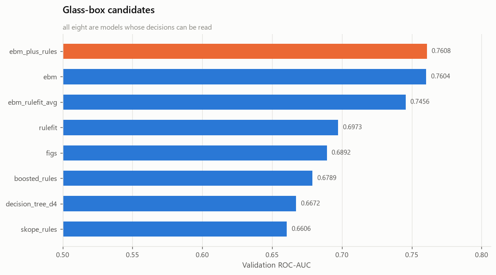
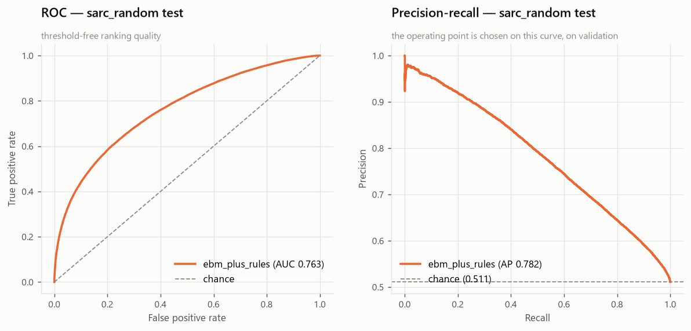
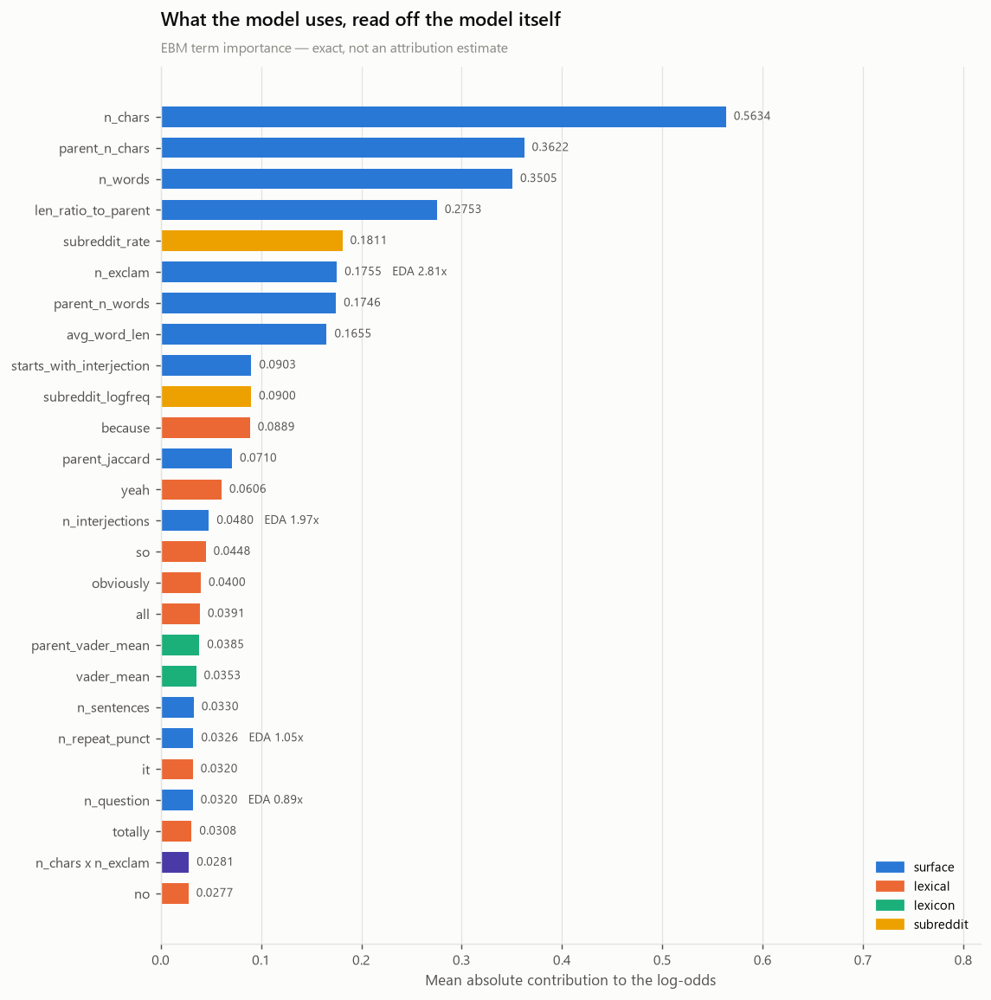
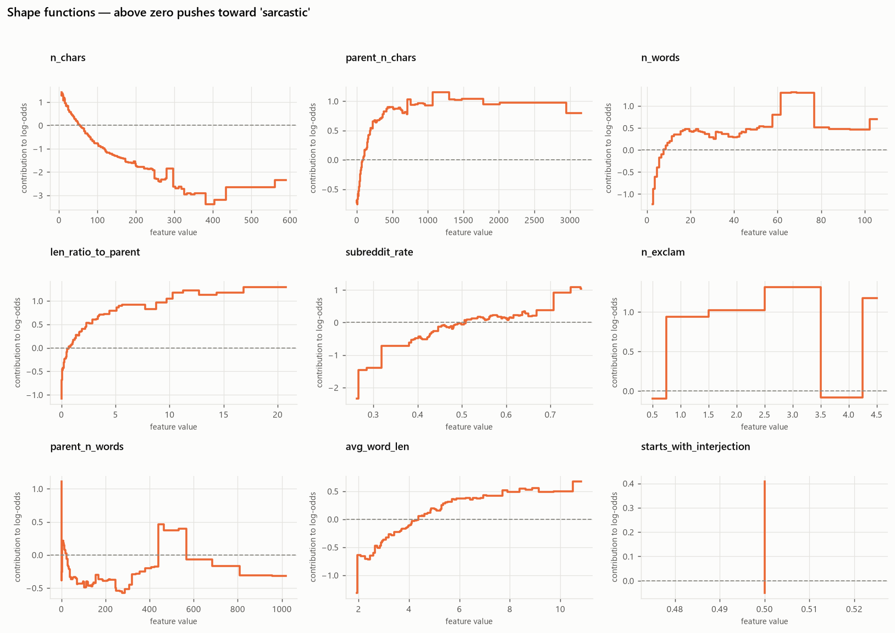
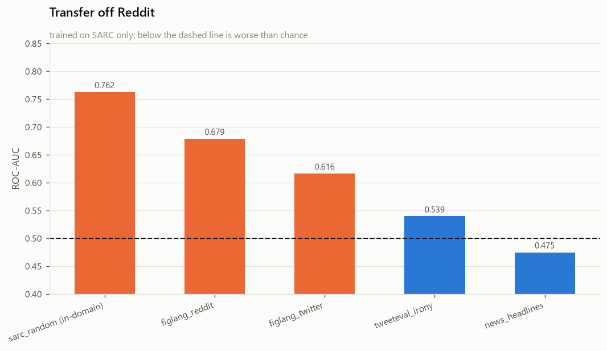

# Glass-box baseline — EBM and rule-based models

Person 5 · CS3244 Group 1
Data: `data/splits/primary/sarc_random`, the 70/15/15 split of the cleaned
913,769-row SARC corpus.

Chinese version: [`glassbox_report_zh.md`](glassbox_report_zh.md).
Every figure quoted here is reproducible from `results/glassbox/*.json`.

---

## Summary

**The Explainable Boosting Machine is the model to use, and the runner-up is
itself.** Eight glass-box candidates were compared; the top two are EBM with
mined rule indicators (validation AUC 0.76082) and plain EBM (0.76040). The gap
is 0.0004 on validation and 0.0005 on test, which is noise, and the winner
carries 70 extra terms. **Plain EBM is the recommendation.**

**Full interpretability costs about 1.4 accuracy points.** Test accuracy is
0.6915 against 0.7059 for the black-box LightGBM baseline, and test AUC 0.7620
against 0.7803. That is the price of every input being a phrase a human can
read, and it is smaller than expected.

**Rule-based learners lose decisively to the EBM.** RuleFit reaches 0.6973,
FIGS 0.6892, boosted rules 0.6789, a depth-6 tree 0.6672. Roughly six AUC points
separate the best rule model from the additive one. Rules are still worth
reporting — a handful of them reach 92% precision on the slices they cover — but
as a description of the data, not as the classifier.

**Averaging the EBM with RuleFit makes things worse** (0.7456, down from
0.7604). Blending a strong model with a much weaker one drags it down; a
combination is not automatically an improvement.

**Length dominates, and the shape is not what a linear model would fit.** The
EBM spends more of its budget on `n_chars`, `parent_n_chars`, `n_words` and
`len_ratio_to_parent` than on any lexical feature. The exclamation-mark curve
rises to a peak at two or three marks and then *falls back to zero* past four —
a shape that a linear or purely lexical model cannot represent, and which the
EDA's single 2.81× lift figure had averaged away.

---

## 1. Why the feature set had to be rebuilt

Person 4's LightGBM run compressed the comment text into 300 truncated-SVD
components. That works for a tree ensemble, but SVD component 137 is not
something anyone can reason about. An EBM fitted on those features would be a
perfectly interpretable function of uninterpretable inputs — which is no use at
all for this slot.

So the features were rebuilt from scratch, every one of them named:

| Block | Count | Example | Share of model |
|---|---:|---|---:|
| Surface | 22 | `n_exclam`, `n_interjections`, `parent_jaccard` | 47.7% |
| Lexical | 300 | `contains 'yeah'`, `contains 'obviously'` | 37.3% |
| Subreddit | 2 | community base rate, log frequency | 5.3% |
| Lexicon | 16 | VADER valence of reply and parent, NRC emotions, incongruity | 5.1% |
| Interactions | 20 | `n_chars × n_exclam` | 4.7% |

**340 base features.** The 300 lexical terms were chosen on the training split
only, ranked by log-odds ratio with an informative Dirichlet prior — the same
estimator the EDA used. They came back matching the EDA's list almost exactly:
*yeah, because, obviously, totally, clearly, oh, wow* on the sarcastic side;
*it, my, think, actually, pretty* on the sincere side. Two independent stages
agreeing on the vocabulary is a useful check that neither is fitting noise.

The lexicon block includes the sentiment-incongruity feature — a warm reply
under a hostile parent — that Person 4's attribution run recommended building
after finding bag-of-words context nearly worthless.

Everything is fitted on train only. The term list, the subreddit encoding map
and the lexicon vocabularies never touch validation, test or the transfer
corpora. Subreddit encoding is out-of-fold with folds grouped by `parent_key`,
so no row sees its own label.

---

## 2. Candidate comparison

Eight candidates, selected on validation ROC-AUC, 200,000 training rows and
60,000 validation rows.



| Model | AUC | Acc | P | R | F1 | Complexity | Fit time |
|---|---:|---:|---:|---:|---:|---|---:|
| **ebm_plus_rules** | **0.76082** | 0.6909 | 0.7198 | 0.6392 | 0.6771 | 430 terms | 277 s |
| **ebm** | 0.76040 | 0.6906 | 0.7173 | 0.6433 | 0.6783 | 360 terms | 204 s |
| ebm_rulefit_avg | 0.74558 | 0.6619 | 0.7742 | 0.4702 | 0.5851 | both components | 0 s |
| rulefit | 0.69731 | 0.6175 | 0.7631 | 0.3559 | 0.4855 | 27 rules | 353 s |
| figs | 0.68918 | 0.6328 | 0.6367 | 0.6420 | 0.6393 | 20 rules | 180 s |
| boosted_rules | 0.67894 | 0.6269 | 0.6403 | 0.6024 | 0.6208 | 80 estimators | 52 s |
| decision_tree_d4 | 0.66724 | 0.6144 | 0.6033 | 0.6992 | 0.6477 | 56 leaves, depth 6 | 4 s |
| skope_rules | 0.66060 | 0.4930 | 0.0000 | 0.0000 | 0.0000 | 40 estimators | 50 s |

Four things worth drawing out.

**The additive model beats every rule learner by a wide margin.** Six AUC points
between EBM and RuleFit is not a tuning artefact — it is the difference between
a model that can assign a smooth weight to all 340 features and one that has to
commit to a few dozen hard conjunctions. Sarcasm signal in this corpus is
diffuse: no small rule set captures it.

**Skope-rules degenerates.** Its precision filter rejects every rule at the
default settings, so it predicts the negative class for everything — hence
precision, recall and F1 all zero while AUC still reads 0.66 from the underlying
scores. Reported as a failure rather than dropped, because "we tried it and it
does not work on this data" is information.

**The combinations disagree with each other.** Adding mined rules as extra EBM
inputs helps by 0.0004; averaging with RuleFit hurts by 0.015. Feeding a weak
model's *features* to a strong one is safe; averaging a weak model's
*predictions* with a strong one's is not.

**RuleFit's cost curve made it not worth pushing.** Going from 60 to 120 rules
took 396 s to 1,799 s for +0.011 AUC, and a 200-rule run was abandoned after 20
minutes. It was never going to catch the EBM, so one representative
configuration was kept.

---

## 3. Test-set performance

The threshold was chosen on validation as the lowest point reaching precision
≥ 0.75, which lands at 0.5412. The proposal treats a false "sarcastic" call as
the expensive error, so the operating point targets precision rather than F1.

| Operating point | Acc | P | R | F1 | AUC | PR-AUC |
|---|---:|---:|---:|---:|---:|---:|
| EBM + rules @ 0.5412 | 0.6887 | **0.7544** | 0.5788 | 0.6550 | 0.7625 | 0.7816 |
| EBM + rules @ 0.50 | 0.6909 | 0.7246 | 0.6368 | 0.6779 | 0.7625 | 0.7816 |
| **plain EBM @ 0.50** | **0.6915** | 0.7231 | 0.6416 | **0.6799** | 0.7620 | 0.7812 |
| *LightGBM (black box)* | *0.7059* | *0.7285* | *0.6760* | *0.7013* | *0.7803* | *—* |
| Majority baseline | 0.5107 | — | — | — | 0.5 | — |

Confusion matrix for the winner at 0.50 (n = 137,065): TN 50,126 · FP 16,939 ·
FN 25,422 · TP 44,578.



The precision target transfers cleanly: 0.75 requested on validation, 0.7544
delivered on test. Recall pays for it, falling from 0.64 to 0.58.

### The cost of interpretability

| | Black-box LightGBM | Glass-box EBM | Gap |
|---|---:|---:|---:|
| Test accuracy | 0.7059 | 0.6915 | −0.0144 |
| Test ROC-AUC | 0.7803 | 0.7620 | −0.0183 |
| Text representation | 300 SVD components | 300 named terms | — |
| Explanation | post-hoc permutation estimate | exact decomposition | — |

About one and a half accuracy points. Whether that is worth paying depends on
what the project is for — and this project is explicitly about identifying
*markers* of sarcasm, where an exact decomposition is worth more than a decimal
place.

### Which of the two finalists to ship

Plain EBM. It is behind by 0.0005 AUC on test and *ahead* on accuracy (0.6915 vs
0.6909) and F1 (0.6799 vs 0.6779). It has 70 fewer terms, trains faster, and
needs no rule-mining step at inference. There is no evidence the rule
indicators add anything.

---

## 4. Reading the model

This is the part the other base-model slots cannot do. LightGBM needs
permutation importance or SHAP, which *estimate* what the model relies on. An
EBM is a sum of one curve per feature — the curves are the model, exactly.



| Rank | Term | Contribution | Block | EDA lift |
|---:|---|---:|---|---:|
| 1 | `n_chars` | 0.5634 | surface | — |
| 2 | `parent_n_chars` | 0.3622 | surface | — |
| 3 | `n_words` | 0.3505 | surface | — |
| 4 | `len_ratio_to_parent` | 0.2753 | surface | — |
| 5 | `subreddit_rate` | 0.1811 | subreddit | — |
| 6 | `n_exclam` | 0.1756 | surface | 2.81× |
| 7 | `parent_n_words` | 0.1746 | surface | — |
| 8 | `avg_word_len` | 0.1655 | surface | — |
| 9 | `starts_with_interjection` | 0.0903 | surface | — |
| 11 | `contains 'because'` | 0.0889 | lexical | — |
| 13 | `contains 'yeah'` | 0.0606 | lexical | — |
| 14 | `n_interjections` | 0.0480 | surface | 1.97× |
| 16 | `contains 'obviously'` | 0.0400 | lexical | — |
| 18 | `parent_vader_mean` | 0.0385 | lexicon | — |
| 25 | `n_chars × n_exclam` | 0.0281 | interaction | — |

### The length result contradicts a reading of the EDA

The EDA reported median length of 9 words in both classes and concluded that
length is not a shortcut. That is true of the *marginal* distribution. It is not
true of the *conditional* effect: with everything else held fixed, the EBM
gives `n_chars` the largest single contribution in the model, swinging from
+1.4 log-odds at very short comments to −3.3 at 400 characters.

Both statements are correct, and the tension between them is the useful part. A
model that only saw length would learn nothing, because the two classes have the
same average length. A model that sees length *alongside* the other features
uses it heavily, because length disambiguates them.



### The exclamation-mark curve is non-monotonic

The EDA gave exclamation marks a single number: 2.81× lift. The shape function
shows what that number averages over. One to three marks push strongly toward
sarcasm (+1.0 to +1.3 log-odds). Four or more fall back to roughly zero.

Three `!` reads as performed enthusiasm. Six reads as genuine excitement. A
linear model is forced to fit one slope through both regimes and necessarily
gets one of them wrong; that is a concrete reason to prefer a shaped model here,
and it is exactly the kind of marker the project set out to find.

`avg_word_len` is cleanly monotonic in the other direction: longer average words
push toward sarcasm, consistent with the mock-formality register that `yeah,
obviously, clearly` also signals.

### Correlated features split their credit

`n_chars` and `n_words` are near-duplicates, and the EBM gives them opposite
shapes — `n_chars` decreasing, `n_words` mostly positive above 10. Neither curve
alone is a statement about sarcasm; only their sum is. This is a known property
of additive models on correlated inputs and belongs in any write-up that quotes
individual curves.

---

## 5. The rule set

Eighty conjunctions were mined from a shallow boosted ensemble and are reported
as a description of the data, not as the classifier.

**Strongest sarcasm rules** (rate and coverage on validation):

| Sarcastic | Covers | Rule |
|---:|---:|---|
| 91.8% | 1.1% | `n_interjections > 0` AND contains *obviously* AND no *but* |
| 90.5% | 1.2% | `n_interjections > 0` AND contains *because* AND `n_words ≤ 19` |
| 89.4% | 1.3% | no *because* AND `n_exclam > 0` AND contains *but* |
| 88.4% | 1.7% | `subreddit_rate > 0.564` AND `n_exclam > 0` AND `n_chars > 41` |
| 87.1% | 2.1% | starts with an interjection AND `avg_word_len > 4.36` AND contains *yeah* |

**Strongest sincerity rules:**

| Sarcastic | Covers | Rule |
|---:|---:|---|
| 22.8% | 1.3% | `subreddit_rate ≤ 0.564` AND `n_words > 22` AND contains *but* |
| 24.5% | 1.3% | `subreddit_rate ≤ 0.564` AND `parent_jaccard > 0.084` AND `n_words > 27` |
| 27.4% | 1.7% | no *all* AND `parent_jaccard > 0.096` AND `n_words > 25` |

The top rule is 92% precise on the 1.1% of comments it covers. That is a usable
high-confidence filter even though the rule *set* as a whole cannot classify the
corpus — which is the shape of the finding: sarcasm markers exist and are sharp,
but they are sparse.

Note how the sincerity rules cluster: long comment, high token overlap with the
parent, low-sarcasm subreddit. That is the signature of someone engaging with an
argument rather than mocking it.

---

## 6. Transfer off Reddit

Same model, trained on SARC only, applied to four independent corpora at the
threshold chosen on SARC validation.



| Target | AUC | Acc | P | R | F1 | Target majority |
|---|---:|---:|---:|---:|---:|---:|
| sarc_random (in-domain) | 0.7625 | 0.6909 | 0.7246 | 0.6368 | 0.6779 | 0.5107 |
| figlang_reddit | 0.6786 | 0.5792 | 0.8284 | 0.1936 | 0.3138 | 0.5028 |
| figlang_twitter | 0.6159 | 0.5417 | 0.6835 | 0.0663 | 0.1208 | 0.5248 |
| tweeteval_irony | 0.5392 | 0.6064 | 0.5517 | 0.0516 | 0.0944 | 0.6026 |
| news_headlines | **0.4747** | 0.5213 | 0.3404 | 0.0079 | 0.0155 | 0.5248 |

Transfer fails, and it fails the same way it did for LightGBM. On news headlines
the AUC is below 0.5, meaning the ranking is anti-correlated with the label —
inverting the output would score better.

Two observations specific to this model.

**The F1 collapse is mostly calibration, not capability.** Recall falls to
0.19, 0.07, 0.05, 0.008 while precision stays respectable (0.83 on
figlang_reddit). The 0.5412 threshold was calibrated on SARC; off-domain the
probability distribution shifts down and almost nothing clears the bar. AUC is
the metric to read across domains, and it degrades far more gently than F1
suggests.

**The glass-box model explains why it fails.** Its two heaviest blocks are
length statistics and Reddit-specific vocabulary. News headlines are uniformly
short and edited; `subreddit_rate` is a constant fallback off-Reddit; the
exclamation-mark curve learned on Reddit points the wrong way on headlines
(2.81× lift there, 0.25× on news per the EDA). Person 4 could only observe the
failure. Here the failure is readable in the model's own terms.

---

## 7. Limitations

Training used 200,000 of the 639,638 available rows. A doubling from 50k to 200k
moved validation AUC from 0.75216 to 0.75606, so the curve is flattening, but
the full corpus was not run and a few thousandths may be left on the table.

Single run, no seed replication. Differences under about ±0.003 should not be
read as real — including the 0.0005 between the two finalists, which is the
basis for recommending the simpler of them.

Term importances describe the *model*, not sarcasm. `subreddit_rate` carries
weight because SARC's `/s` annotation convention varies by community (8% in
r/RoastMe, 79% in r/creepyPMs), not because community causes sarcasm.

The 300 lexical indicators are presence flags, so the model cannot see word
order or repetition within a comment. Bigrams recover a little of this; a
glass-box model that handled sequence would need a different architecture.

Author overlap is inherited from the split: 84% of test authors also appear in
training. The model may be reading individual style.

---

## 8. Recommendations

| Priority | Recommendation | Basis |
|---|---|---|
| High | Ship plain EBM, not the rule-augmented version | Test gap 0.0005, 70 fewer terms, higher accuracy and F1 (§3) |
| High | Use the exclamation-mark shape function in the write-up | Non-monotonic curve that no other slot can produce (§4) |
| High | Report the length result carefully — marginal vs conditional | Contradicts a plain reading of the EDA (§4) |
| Medium | Quote the top rules as findings, not as a classifier | 92% precision on 1.1% coverage; rule sets lose by 6 AUC points (§5) |
| Medium | Use AUC for cross-domain comparison; list F1 separately | Off-domain F1 collapse is calibration (§6) |
| Medium | Skip further rule-model tuning | RuleFit costs 4.5× per doubling for +0.011 AUC (§2) |
| Low | Retrain on the full 640k rows for the final report | Learning curve is flattening but not flat (§7) |
| Low | Run three seeds for error bars | Single run cannot resolve ±0.003 (§7) |

---

## Reproducing

```bash
python modelling/glassbox/20_build_features.py   # ~30 s
python modelling/glassbox/21_train.py            # ~35 min, --resume supported
python modelling/glassbox/22_evaluate.py         # test + transfer
python modelling/glassbox/23_explain.py          # importance, shapes, rules
```

| Output | Contents |
|---|---|
| `results/glassbox/selection.json` | Leaderboard and winner |
| `results/glassbox/candidate_trials.csv` | Every trial with timings |
| `results/glassbox/evaluation.json` | Test and transfer, both finalists |
| `results/glassbox/ebm_term_importance.csv` | All 360 terms, ranked |
| `results/glassbox/rules.csv` | All 80 rules with coverage and rate |
| `results/glassbox/explanation.json` | Machine-readable explanation |
| `figures/glassbox/G01`–`G05` | Figures |
