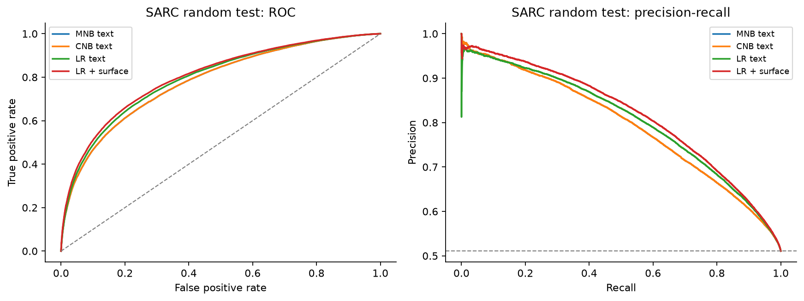
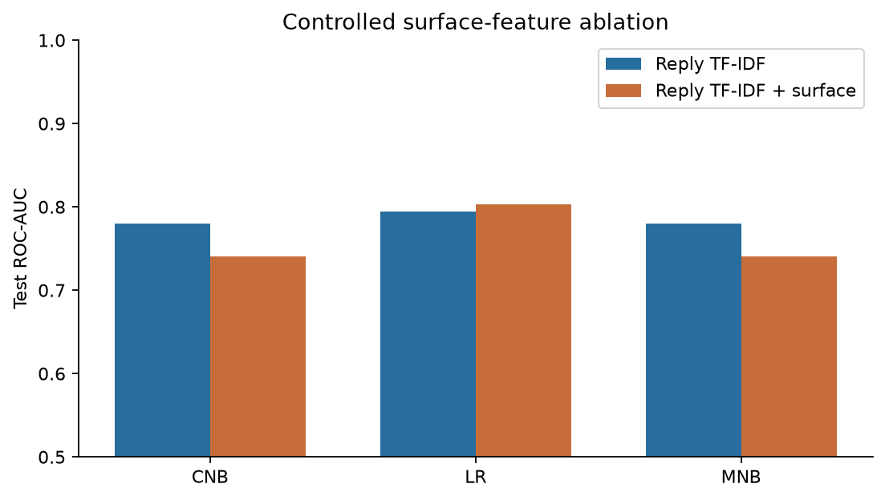
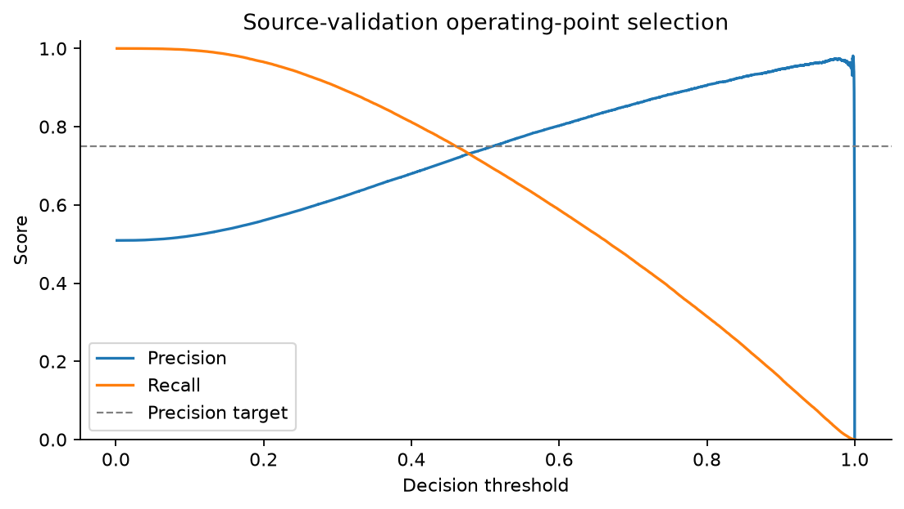
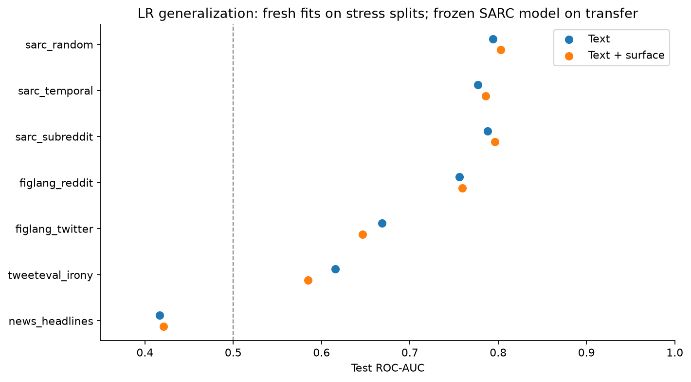
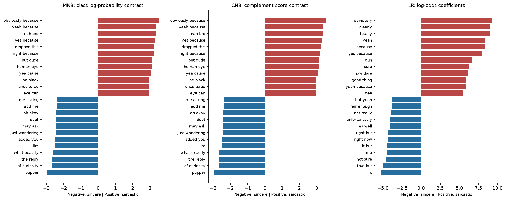
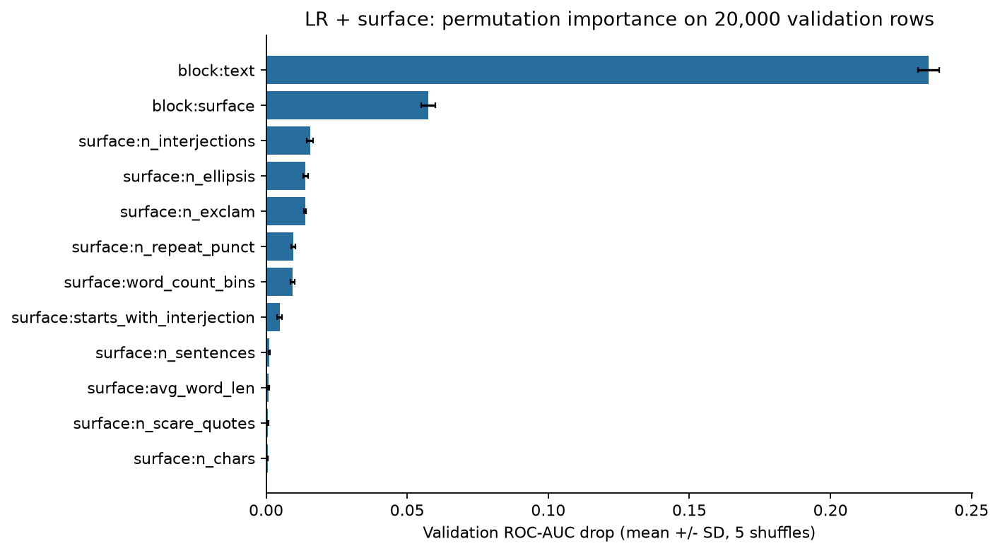

# Person 1 probabilistic and linear NLP experiment

This experiment compares Multinomial Naive Bayes (MNB), Complement Naive Bayes
(CNB), and Logistic Regression (LR) on the team's frozen SARC splits. The best
LR representation by source-validation ROC-AUC is `reply_tfidf_surface`;
its held-out SARC random test ROC-AUC is **0.8029** and accuracy
is **0.7283**. All numbers below come from executed fits and
saved predictions, not from the earlier 200k-row preprocessing smoke test.

## Data and selection protocol

- Base branch: `python_nb_ver2`, source commit `e894158eb8cf4fc29273a68bb65caa018517f2b6`.
- All 15 downloaded source checksums match `data/MANIFEST.json`.
- The original cleaning pipeline reproduces 913,769 primary rows. All 21
  train/validation/test counts match the shared split card. See `data_audit.csv`.
- Full sarc_random train: 639,638; validation: 137,066; test: 137,065. No training subsample.
- Vocabulary, IDF and surface scaling are fitted on train only. Validation is
  retained for model/threshold selection and is not merged into final training.
- Twenty text-only candidates: 2 ngram settings x (3 MNB alpha + 3 CNB alpha +
  4 LR settings). ROC-AUC on source validation selects each family's setting.
- TF-IDF: unigrams or unigrams+bigrams; `min_df=3`, `sublinear_tf=True`,
  lowercase, default word tokenization, L2 row normalization; no stopword
  removal, vocabulary cap or SVD. The bigram settings match Person 2's current
  vectorizer, but Person 2's notebook currently uses a different training budget;
  its results are not yet a fully controlled SVM-vs-LR comparison.
- NB alpha: 0.1/1/10. LR L2 C: 0.1/1/10 plus one L1 C=1 trial;
  `liblinear`, max_iter=1000, tol=1e-4, seed=3244. Convergence is checked.
- The surface ablation reuses each text winner's ngrams and model parameters.
  This holds these settings fixed; it is not a separate exhaustive search.
- Safe reply-only surface fields: n_chars, n_words, n_sentences, avg_word_len, n_exclam, n_question, n_ellipsis, n_repeat_punct, n_allcaps_words, allcaps_ratio, n_elongation, n_scare_quotes, n_urls, n_mentions, n_hashtags, n_interjections, starts_with_interjection. Replace raw n_words
  by fixed bins 0-3/4-6/7-8/9-12/13-20/21-40/41+. Count fields use log1p;
  divide by training standard deviations without centering. Output remains
  nonnegative for NB. Parent, subreddit, author, time, votes and audit flags
  are excluded from this lexical comparison.
- Each stress scheme refits its OWN vocabulary, scaler and classifiers on its
  own train. Hyperparameters and source-selected thresholds are frozen.
- Transfer uses the sarc_random-trained LR on each supplementary TEST only,
  with no target-domain training, fitting, tuning or threshold calibration.

## Selected text configurations

```json
{
  "MNB": {
    "params": {
      "alpha": 1.0
    },
    "ngram_max": 2,
    "val_roc_auc": 0.7770739936127524
  },
  "CNB": {
    "params": {
      "alpha": 1.0
    },
    "ngram_max": 2,
    "val_roc_auc": 0.7770739936127524
  },
  "LR": {
    "params": {
      "C": 1.0,
      "penalty": "l2"
    },
    "ngram_max": 2,
    "val_roc_auc": 0.7913867933042598
  }
}
```

## In-domain comparison at threshold 0.50

PR-AUC is **average precision**, not trapezoidal PR integration. Class 1 is
sarcastic. Runtime, feature dimensionality, Brier score and confusion counts
are included in `metrics.csv` and `fit_log.json`.

| model | representation | ngram_max | roc_auc | pr_auc | accuracy | precision | recall | f1 |
| --- | --- | --- | --- | --- | --- | --- | --- | --- |
| MNB | reply_tfidf | 2 | 0.7798 | 0.7934 | 0.7041 | 0.7133 | 0.7035 | 0.7083 |
| MNB | reply_tfidf_surface | 2 | 0.7406 | 0.7447 | 0.6839 | 0.7304 | 0.6038 | 0.6611 |
| CNB | reply_tfidf | 2 | 0.7798 | 0.7934 | 0.7044 | 0.7204 | 0.6884 | 0.7040 |
| CNB | reply_tfidf_surface | 2 | 0.7406 | 0.7447 | 0.6829 | 0.7333 | 0.5957 | 0.6574 |
| LR | reply_tfidf | 2 | 0.7941 | 0.8047 | 0.7206 | 0.7395 | 0.6991 | 0.7187 |
| LR | reply_tfidf_surface | 2 | 0.8029 | 0.8159 | 0.7283 | 0.7484 | 0.7051 | 0.7261 |



## Controlled surface-feature ablation

| model | reply_tfidf | reply_tfidf_surface | surface_auc_delta |
| --- | --- | --- | --- |
| CNB | 0.7798 | 0.7406 | -0.0392 |
| LR | 0.7941 | 0.8029 | 0.0088 |
| MNB | 0.7798 | 0.7406 | -0.0392 |



The delta isolates the addition of the declared reply-surface block at frozen
text hyperparameters. It does not establish a causal linguistic effect.
The surface block improves LR but hurts both NB variants in this run. Its
scaled numeric values are treated as additional feature mass by NB; that can
distort the multinomial feature model. This negative result does not imply
that the cues lack signal, and no test-driven rescaling was performed.

MNB and CNB have identical ranking/AUC here for a mathematical reason:
with two classes and CNB `norm=False`, the complement of one class is the
other class. Their feature-weight contrasts coincide. MNB additionally uses
the class-prior offset, so probabilities and fixed-threshold metrics may differ.
They are not independent sources of ranking evidence for an ensemble.

## Precision-oriented operating point

The 0.75 precision target follows the existing glass-box configuration.
For each model, choose the source-validation threshold with highest recall
among points achieving precision >=0.75. The same numeric threshold is frozen
on stress and transfer. The target is a validation constraint, not a guarantee
on new data. No target/test labels enter threshold selection.

| model | representation | threshold | precision | recall | f1 |
| --- | --- | --- | --- | --- | --- |
| MNB | reply_tfidf | 0.5465 | 0.7541 | 0.6255 | 0.6838 |
| MNB | reply_tfidf_surface | 0.6004 | 0.7547 | 0.5208 | 0.6163 |
| CNB | reply_tfidf | 0.5375 | 0.7541 | 0.6255 | 0.6838 |
| CNB | reply_tfidf_surface | 0.5916 | 0.7547 | 0.5208 | 0.6163 |
| LR | reply_tfidf | 0.5224 | 0.7547 | 0.6716 | 0.7107 |
| LR | reply_tfidf_surface | 0.5102 | 0.7549 | 0.6940 | 0.7232 |



## Independent stress fits

| dataset | model | representation | roc_auc | auc_delta_vs_random |
| --- | --- | --- | --- | --- |
| sarc_random | MNB | reply_tfidf | 0.7798 | 0.0000 |
| sarc_random | MNB | reply_tfidf_surface | 0.7406 | 0.0000 |
| sarc_random | CNB | reply_tfidf | 0.7798 | 0.0000 |
| sarc_random | CNB | reply_tfidf_surface | 0.7406 | 0.0000 |
| sarc_random | LR | reply_tfidf | 0.7941 | 0.0000 |
| sarc_random | LR | reply_tfidf_surface | 0.8029 | 0.0000 |
| sarc_temporal | MNB | reply_tfidf | 0.7636 | -0.0162 |
| sarc_temporal | MNB | reply_tfidf_surface | 0.7181 | -0.0224 |
| sarc_temporal | CNB | reply_tfidf | 0.7636 | -0.0162 |
| sarc_temporal | CNB | reply_tfidf_surface | 0.7181 | -0.0224 |
| sarc_temporal | LR | reply_tfidf | 0.7769 | -0.0171 |
| sarc_temporal | LR | reply_tfidf_surface | 0.7856 | -0.0173 |
| sarc_subreddit | MNB | reply_tfidf | 0.7716 | -0.0081 |
| sarc_subreddit | MNB | reply_tfidf_surface | 0.7302 | -0.0103 |
| sarc_subreddit | CNB | reply_tfidf | 0.7716 | -0.0081 |
| sarc_subreddit | CNB | reply_tfidf_surface | 0.7302 | -0.0103 |
| sarc_subreddit | LR | reply_tfidf | 0.7881 | -0.0060 |
| sarc_subreddit | LR | reply_tfidf_surface | 0.7963 | -0.0066 |

Differences describe performance under different population/split conditions;
they are not a pure causal estimate of year or community information.

## Frozen-model cross-corpus transfer

| dataset | representation | roc_auc | pr_auc | accuracy | precision | recall | f1 |
| --- | --- | --- | --- | --- | --- | --- | --- |
| figlang_reddit | reply_tfidf | 0.7562 | 0.7631 | 0.6931 | 0.7057 | 0.6564 | 0.6801 |
| figlang_twitter | reply_tfidf | 0.6683 | 0.6546 | 0.6233 | 0.6411 | 0.4712 | 0.5431 |
| tweeteval_irony | reply_tfidf | 0.6153 | 0.5146 | 0.6167 | 0.5263 | 0.3548 | 0.4239 |
| news_headlines | reply_tfidf | 0.4168 | 0.4157 | 0.4651 | 0.4005 | 0.2526 | 0.3098 |
| figlang_reddit | reply_tfidf_surface | 0.7593 | 0.7650 | 0.6976 | 0.7050 | 0.6735 | 0.6889 |
| figlang_twitter | reply_tfidf_surface | 0.6466 | 0.6274 | 0.6076 | 0.6268 | 0.4307 | 0.5105 |
| tweeteval_irony | reply_tfidf_surface | 0.5847 | 0.5030 | 0.5974 | 0.4919 | 0.3935 | 0.4373 |
| news_headlines | reply_tfidf_surface | 0.4210 | 0.4173 | 0.4602 | 0.3993 | 0.2694 | 0.3217 |



Transfer changes platform, label conventions, class priors and language style.
Ranking metrics and threshold-sensitive metrics must therefore be discussed
separately. `dummy_baselines.csv` uses the SOURCE training prior, never the
target's test-label majority as a deployable baseline.

## Explanations and failure analysis



Positive LR coefficients increase sarcastic log-odds conditional on the other
features. MNB plots use log P(feature|sarcastic) - log P(feature|sincere).
CNB plots use its complement-derived decision-weight contrast; those weights
must not be mislabelled as ordinary class-conditional word probabilities.
Coefficient magnitude is not the same as per-example contribution: an example
contributes TF-IDF value times coefficient.

`eda_token_comparison.csv` compares prespecified EDA tokens with LR weights.
Mock-agreement and intensifiers can be useful, but topical terms such as
women/racist/white may encode community/topic associations. The coefficients
alone do not prove a token is an intrinsic or universal sarcasm marker.



Permutation results use a fixed 20,000-row SOURCE validation subset and five
shuffles, after selection. Error bars are shuffle SDs, not confidence intervals.
Correlated predictors can share/substitute signal, so low individual importance
does not prove irrelevance. Six confident false-positive/false-negative cases,
with actual feature contributions, are in `lr_error_examples.json`.

Example error: `false_positive`, p(sarcastic)=0.9985.
The notebook displays the error table and links its contribution records.

## Limitations

- These are lexical and surface models; no pretrained language model is used.
  They do not reason about context, world knowledge or the speaker's intent.
- NB probability outputs are not assumed calibrated; CNB's probability-like
  scores especially should be checked before probability averaging. Brier
  scores are supplied. LR probabilities are also not guaranteed calibrated.
- The shared corpus is self-labelled with /s; absence of that tag does not
  guarantee literal language. Results predict curated labels, not perfect
  human sarcasm judgments.
- Upstream cleaning removes conflicting-label duplicates across the full
  corpus before splitting, and the supplied EDA informed feature design.
  Evaluation is conditional on that curation and is not a fresh untouched
  external benchmark. The split audit checks overlap, not every possible bias.
- Authors overlap across splits (reported by the team as 84% of random test
  authors, 36% temporal, 72% subreddit); author IDs are not model inputs.
- Hyperparameter search is deliberately modest; only one L1 setting is tested.
  Single-seed point estimates are not significance tests.

## Reproduction and ensemble handoff

Run `modelling/probabilistic_linear/person1_baselines.ipynb` top to bottom.
Its default mode reads the committed completed results; set `RUN_TRAINING=True`
to reproduce fitting, then rerun reporting. See the adjacent README for setup.

Each final fit has a saved joblib bundle with vectorizer, model, optional surface
transformer and threshold. All 18 bundles pass save/reload probability checks.
Fitted model files in `artifacts/person1/` are retained locally and intentionally
excluded from this GitHub submission. The notebook can regenerate these exports
from the shared prepared data. Local exports share fitted vectorizers and exact
float64 decision weights and were verified against the original models. The
optional saved-model demonstration skips when these local files are absent.
`predict(bundle, cleaned_dataframe)` supports primary and supplementary schemas.
Prediction parquet files include content-derived row_id, original split row
position, label and probability. Align ensemble inputs by row_id, not sampled
row order. Use only one split scheme at a time.
Committed `results/person1/ensemble_predictions/` tables combine model columns
on the common row index without rounding probabilities; `index.json` describes
the columns. Larger per-model predictions/full weight tables regenerate locally.

For stacking, `make_oof()` constructs GroupKFold predictions, refitting TF-IDF
and scaling inside every fold. Full-fit training predictions are not OOF.
The separate `RUN_OOF` notebook switch controls this extra Person 6 handoff;
the report does not claim OOF was executed unless an OOF artifact is present.
